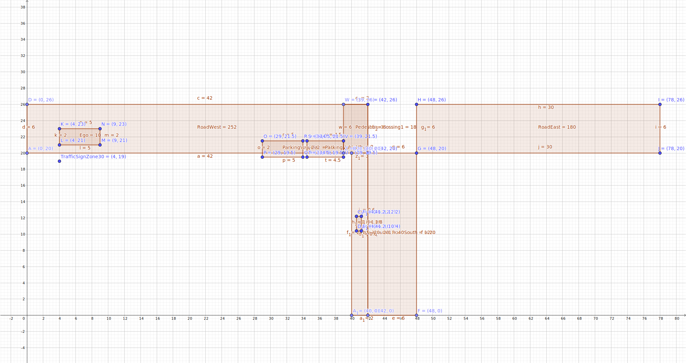
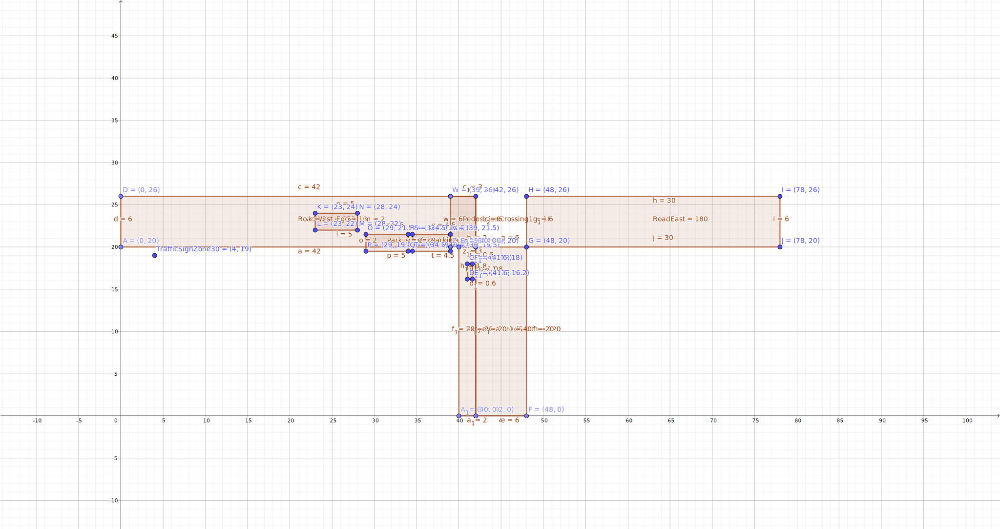
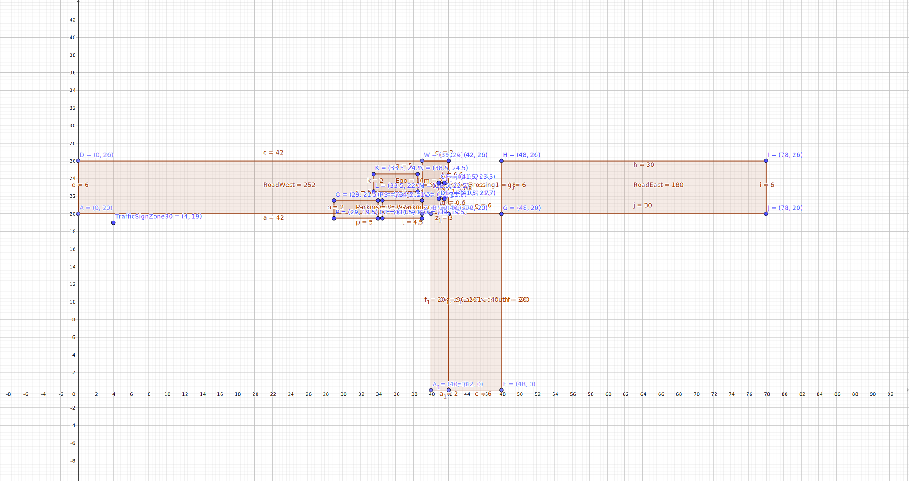

# Leveraging A.U.T.O. for semantic data analysis of A-Boxes

This software demonstrates how the formalizations of criticality phenomena within A.U.T.O. can be used to infer their presence in scenes and scenarios.  
We provide two use cases:

1. Reasoning on the VVMethods Functional Use Case 2.3
2. Reasoning on the inD snippet provided by the ika at the RWTH Aachen

## Getting started

First, initialize all submodules: `git submodule update --init --recursive`.

### Install dependencies 

For inD reasoning, we need the `omega_format` package as provided by the corresponding submodule in this git (`oemga2auto/omega_format`). 
The installation instructions for `omega_format` are given in `omega2auto/omega_format/README.md`. 

Once `omega_format` is installed, continue with the dependencies for this package as listed in `requirements.txt`. 
Install them by `pip install -r requirements.txt`.
Note that `owl_augmentator`, `pyauto`, and `omega2auto` are local packages from git submodules which you can install via calling `pip install -e $pkg_name` from this directory. 

#### Patching `owlready2` <0.36

If you use `owlready2` < 0.36, there exists a bug which can simply be patched by changing one line in your local copy of `owlready2` (see corresponding [pull request](https://bitbucket.org/jibalamy/owlready2/pull-requests/12)).

#### Patching `owlready2` 0.36

`owlready2` 0.36 has an issue handling URI prefixes of A.U.T.O. ('http://purl.org/auto/#'). 
This manifests when saving the A-Box to an OWL file.
To avoid this, we provide a patch file `patches/owlready2_driver.patch` that can be applied to your local copy of `owlready2` by:

`patch /path/to/your/local/owlready2/driver.py < patches/owlready2_driver.patch`

### Running the first example

To run our first example on the Functional Use Case 2.3, just execute `python infer.py --output fuc23.owl fuc23`. 

The scenario adheres to the following three scenes:

, 
, 
.

The script performs the following steps:

1. Loading A.U.T.O. in Python using `owlready2`.
2. Creating three scenes in its A-Box, corresponding to the first three snapshots of the Functional Use Case 2.3.
3. Augmenting the A-Box using the `owlready2_augmentator` package. Performed augmentations are stored in the folder `auto_extensions`, one python file for each ontology. The augmencated classifitions, object and data properties are written to the A-Box.
4. Performing reasoning using the Pellet reasoner on both the DL axioms as well as the SWRL rules.
5. Printing inferred criticality phenomena.

You can visualize the resulting scenario including all inferences by `python visualize.py fuc23.owl`, opening in a new tab in your browser. 

If you want to compare these inferences against the 'ground truth' version of the scenario, use `python infer.py --convert-only --output fuc23_gt.owl fuc23 && python visualize.py fuc23_gt.owl`. 
This will yield a visualization without any inferences. 

## General usage

### Inference

We provide a single entry point to reason on scenarios given as OMEGA files: `infer.py`. 
Check `python infer.py -h` for information on its usage. 

A simple example is:

`python infer.py --output outputs/inD_inferences.owl --logging debug inputs/inD.hdf5`

This will run the inferences services on the input OMEGA file and store the A-Box with all the inferences in `outputs/inD_inferences_${i}.owl` for $`i \in \{1, \dots, n\}`$ with $`n`$ scenarios in the input file. 

Note that you will need to obtain an OMEGA-file for your own. Due to licensing, we can not provide the inD OMEGA-file used in this example.

### Reasoner settings

Depending on your hardware, it can be advantageous to play around with Pellet's settings by changing the `command` list in `owlready2`'s `reasoning.py`. 
For example, using `OWLAPIv3` instead of `Jena` as the Pellet loader can result in reduced memory consumption (although `owlready2` states the `OWLAPIv3` loader to be bugged). 

### Visualization

Each output scenario can then be visualized using the second tool, `visualize.py`:

`python visualize.py outputs/inD_inferences_i.owl` for a single scenario `i` resp. `for f in outputs/*.owl; do python visualize.py "$f"; done` to visualize all scenarios.

This will print the list of infered criticality phenomena to the terminal and opens a browser tab containing a visualization of the scenario including its criticality phenomena.
